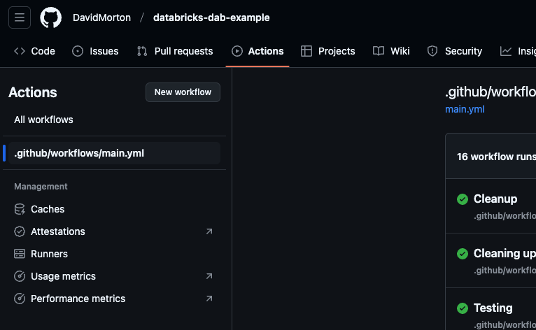
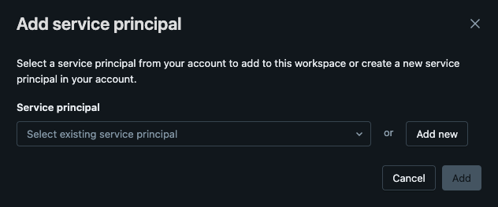
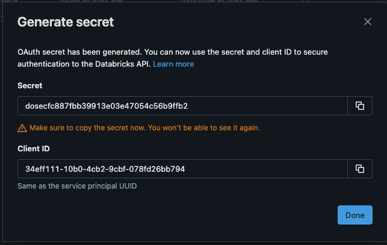
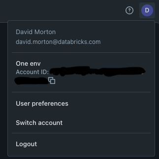
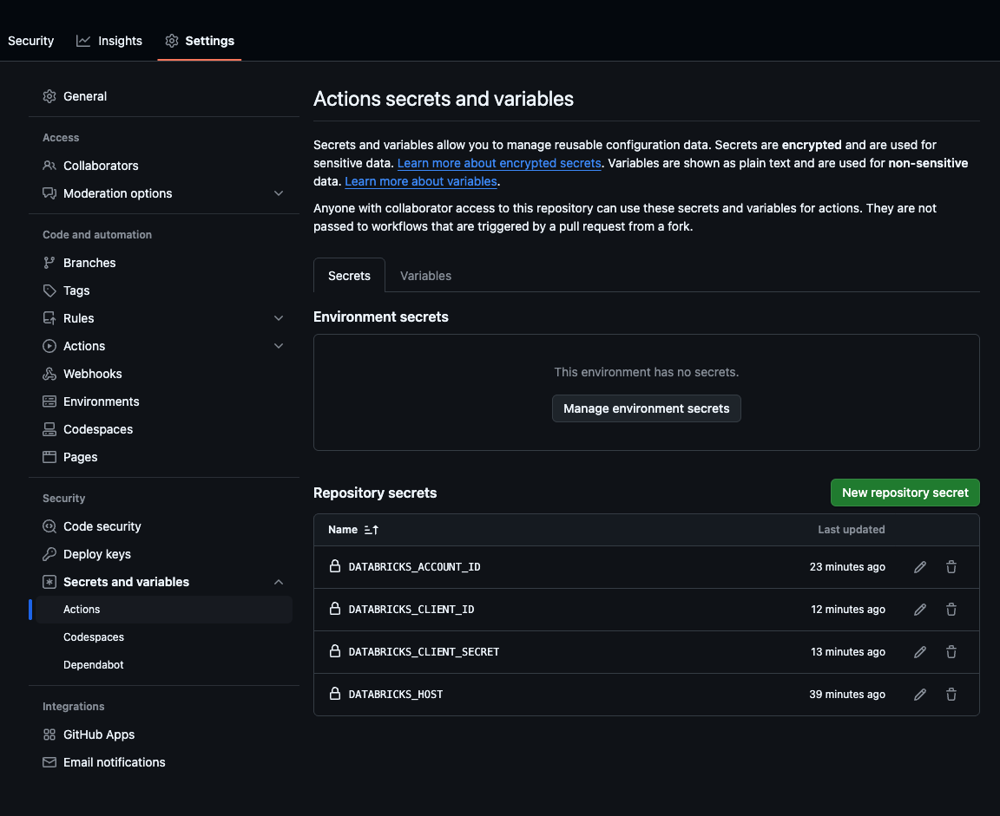

# Skeleton for deploying Databricks Apps using DAB

## Intro

Databricks Asset Bundles (DABs) are the suggested way to accomplish CI/CD on Databricks. With DABs, you can create a repository where all your assets, from pipelines and workflows to notebooks and apps, can be deployed as one unit.

Here we're going to focus specifically on deploying Databricks apps, but we're going to do it with a twist. While Databricks Apps are advertised as a great way to deploy Flask or Dash apps, we're going to deploy a reflex.dev app because... well, why not?

This repo has a blank starter template for deploying a reflex.dev website via a Databricks DAB. The site itself is pretty simple, being that it's the default template for reflex.dev applications, but it can be extended or changed to do whatever you need.

## Quick Tour

### databricks.yml

The root folder contains the databricks.yml file that defines the bundle. You'll notice that it has no deployment target hardcoded into it. There's a reason for this that we'll get around to later. The main takeaway from this is that it references the resources folder, which contains one other YAML script, which, in this case, deploys the website. Should you need other resources deployed, you would add additional YAML files into this resources folder. 

### app folder

The app folder contains the actual application itself, starting with the config file for the reflex.dev application (which you can find more information about on the [reflex.dev](https://reflex.dev/) home page).

You'll also find a requirements.txt file within the folder where you can include all your dependencies to be installed via PyPi. 

### .github folder

The github folder contains the action necessary to deploy the application. You'll notice there is neither a target workspace, nor a workspace token in this file. For security reasons, these values will be set within the action's secrets.

## Setting this up

### Viewing the GitHub Action

First, fork this repo into your own environment, or copy it to a new repo. As this is a personal repository of mine, you'll have no access to perform any deployments from this repo. 

Once you've created a new repo in GitHub containing the contents of this repo, go to the Repository's Actions tab in the UI. It's here where you'll be able to see the GitHub action that resides within the .github directory. If you click the action path on the left pane, and then the blue link to the action in the right pane near the top, you can view the deployment script and modify it if you'd like.

### Setting up a service principal to deploy the app

To execute the action, we're going to set up a service principal, and then use it to deploy the application by authenticating through OAuth.

1. In Databricks, visit the workspace to which you'd like to deploy your app.

1. In the upper right corner, click the icon with your initial or photo on it, and go to Settings.
1. On the settings page, navigate to Identity and access in the right panel. 
1. On the right panel, click to manage service principals. (If you already have a service principal, feel free to skip this step.)
1. Click to add a service principal.

6. Click "Add New"

1. Enter a name for your service principal and click "Add".
1. Go back to managing service principals.
1. Click on the link for the service principal you created.
1. Click on the Secrets tab.
1. Generate a new OAuth Secret by clicking the "Generate Secret" button. 
1. Select the lifetime for your secrets, and click "Generate".  _**Do not close the dialog that appears until you complete the next couple of steps.**_

13. Copy the secret from the dialog box that appears.

1. In another browser window, open your GitHub repo and navigate to the repo settings.
1. On the left panel, navigate to Secrets and variables, followed by Actions.
1. Create a new repository secret. Name it DATABRICKS_CLIENT_SECRET, and for the value, paste the secret value from when you set up the OAuth secret in Databricks.
1. In Databricks, copy the value for the Client ID from the dialog.
1. In GitHub, create a new repository secret. Name it DATABRICKS_CLIENT_ID, and for the value, paste the client ID from the above step. You should be safe to close the dialog now.
1. In Databricks Click your workspace name in the top right, and click on Manage Account.
1. Once on the account console, click your initial on the top right of the page. You should see an Account ID in the menu that appears. Copy it.

 

21. In GitHub, create another repository secret. Name it DATABRICKS_ACCOUNT_ID, and paste the value you just copied.

1. On your Databricks tab, copy the hostname (without any URL path) of your Databricks workspace. You should be able to get this from your browser's navigation bar.
1. In GitHub, create a new repository secret. Name it DATABRICKS_HOST, and paste the hostname in as the value. Remember to exclude any part of the URL following the domain name. Your final secrets page should look like the image below. You should have four secrets in all.

### Running the action

1. In your GitHub repo, navigate to the actions tab. You should see a failed action run from earlier in the list of workflow runs. It failed because, when you first checked in the files, you were lacking the necessary secrets in GitHub to connect to the databricks workspace. Click into the failed run. 

1. Near the top right of the page, you should see a button that says "Re-run all jobs". Click it. If all goes well, this should deploy the application for you.

### Verifying the app is deployed

1. Back in your Databricks workspace, on the left panel, navigate to Compute.

1. Click into the Apps tab.
1. Click the name of the app in the list.

You should see the current status of the app, whether it's running or not. From here you can also examine the logs in case something failed. 

*NOTE: AT THE TIME OF WRITING, THIS APP CRASHES INITIALLY. CLICK THE DEPLOY BUTTON ON THE TOP RIGHT, AND THE SECOND TIME, AND EACH SUBSEQUENT TIME AFTER, IT SHOULD WORK FINE* 

## Conclusion

That's it! 

From this point onward, any changes to the repository should trigger a re-deployment of the application. 

On GitHub, you can find [documentation about actions](https://docs.github.com/en/actions) in case you want to make more finely tuned adjustments to the deployment, and within Databricks, you can find [more information about Databricks Asset Bundles](https://docs.databricks.com/aws/en/dev-tools/bundles/).

If you want to go above and beyond, [include your git repo as a git folder within Databricks](https://docs.databricks.com/aws/en/repos/repos-setup) so you can edit the code directly within Databricks.